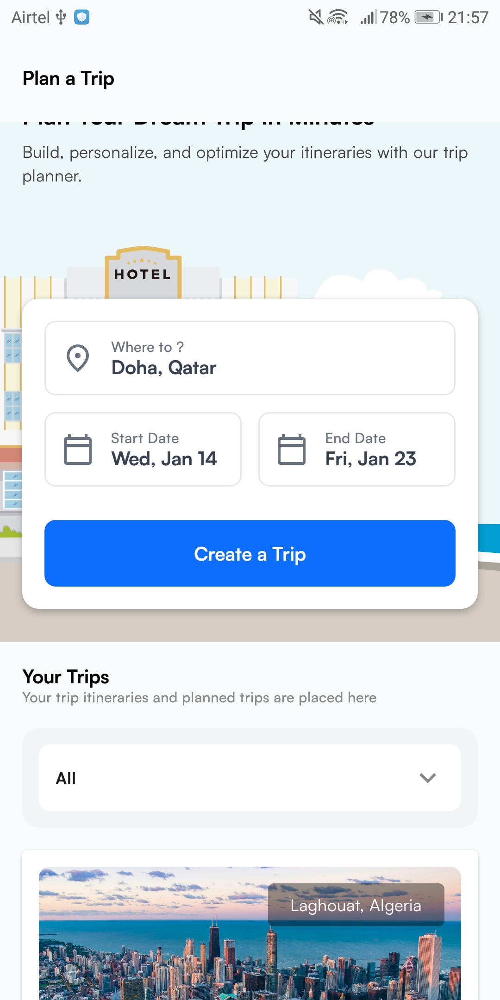
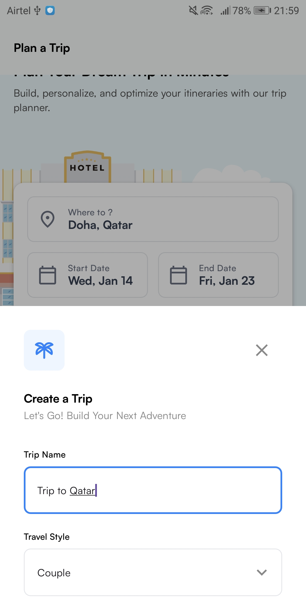
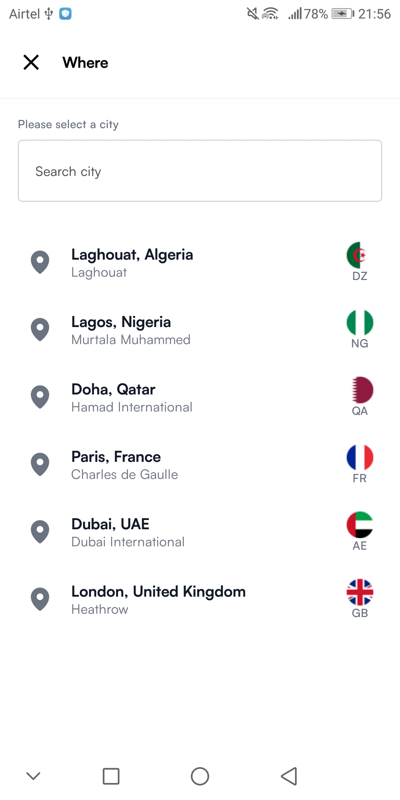
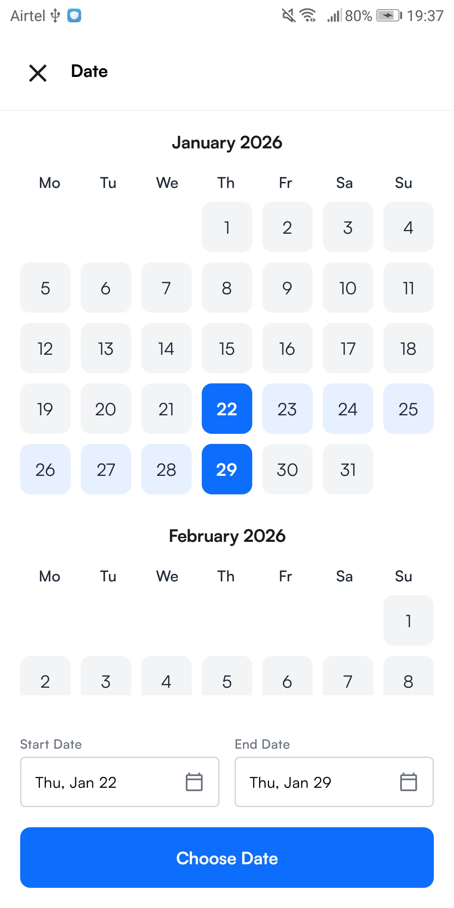
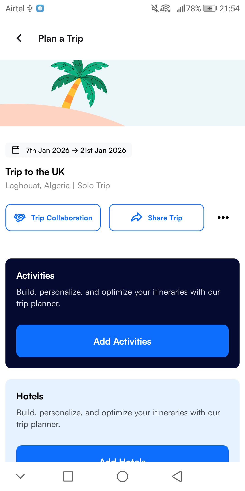
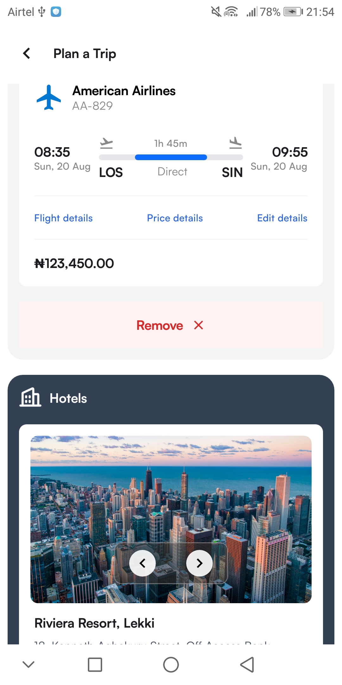

# ✈️ Trip Planner – Android App

An Android application that allows users to **create, view, and manage trips**, built as part of an Android Developer interview assessment.  
The app closely follows the provided **Figma UI design** and integrates with a **CRUD API** for trip operations.

---

## 📱 Features

- View all planned trips
- Create a new trip
- View trip details
- Pixel-perfect UI based on Figma design
- API integration for CRUD operations
- Loading, success, and error state handling
- Clean architecture with state-driven UI

---

## 🎨 UI Design

The UI was implemented based on the provided Figma design, ensuring close adherence to:
- Spacing
- Typography
- Colors
- Layout structure
- Component behavior

🔗 **Figma Design:**  
https://www.figma.com/design/QomXDEA1WE6pDJFhMcPqyt/Task-UI?node-id=1-5512

---

## 🚀 Getting Started

### Prerequisites

- Android Studio Hedgehog or newer
- Android SDK 24+
- Internet connection

### Setup Instructions
```bash
# Clone the repository
git clone https://github.com//OkoloArt//trip-planner.git

# Open the project in Android Studio
# Sync Gradle
# Run on emulator or physical device
```

---

## 📦 APK

📥 **APK Download:**  
[Download APK](https://drive.google.com/file/d/1chjuSA5R2mpLpyEbhrCrusQr_CDSz3Bp/view?usp=drive_link)

---

## 🖼️ Screenshots

<div align="center">









</div>

---

## 🎥 Screen Recording

<div align="center">
  <video src="https://github.com/user-attachments/assets/ad1480d1-e87e-4404-b0c6-77675c1c84f9" width="350" controls></video>
</div>

**Features demonstrated:**
- Creating a new trip
- Viewing all trips
- Filtering by travel style
- Viewing trip details
- Loading and error states

---

## 🏗️ Tech Stack

- **Language:** Kotlin
- **UI:** Jetpack Compose (Material 3)
- **Architecture:** MVVM
- **State Management:** StateFlow
- **Networking:** Ktor Client
- **Dependency Injection:** Hilt
- **Image Loading:** Coil
- **Asynchronous Programming:** Kotlin Coroutines

---

## 📦 Project Structure
```
com.example.tripplanner
│
├── data
│   ├── model          # DTOs and request models
│   ├── remote         # API services
│   └── repository     # Data repositories
│
├── ui
│   ├── screens        # Compose screens
│   ├── components     # Reusable UI components
│   ├── theme          # Colors, typography, shapes
│   └── viewmodels     # ViewModels
│
├── navigation         # NavGraph
│
└── utils              # Helpers & extensions
```

---

## 🌐 API Integration

🔗 **API Base URL:**  
`https://beeceptor.com/crud-api/`

### Endpoints Used

| Action | Method | Endpoint |
|--------|--------|----------|
| Create Trip | POST | `/trips` |
| Get All Trips | GET | `/trips` |
| Get Trip By ID | GET | `/trips/{id}` |

---

## 👨‍💻 Author

**Okolo Arthur**  
Android Developer

🔗 [GitHub Profile](https://github.com//OkoloArt)

---

## 📄 License

This project is licensed under the MIT License - see the [LICENSE](LICENSE) file for details.

---

## 🙏 Acknowledgments

- Figma design team for the UI specifications
- Interview assessment team for the opportunity
